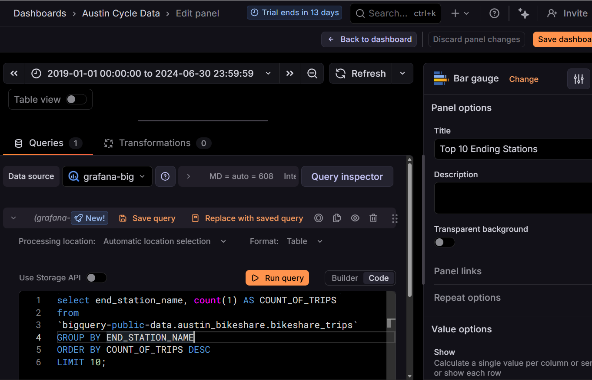
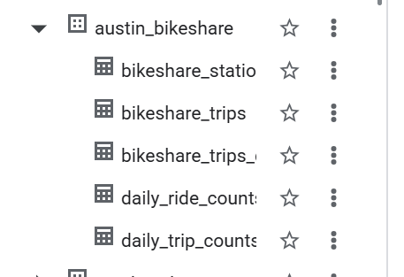

# Austin Bikeshare Analytics Grafana Dashboard

Bike sharing, also known as a bicycle-sharing system, is a service that provides bicycles for shared use by individuals at low costs. Users can rent bikes from designated docking stations or through dockless systems, where bikes can be picked up and dropped off at various locations within a city. 

Austin Bike Sharing Dataset is a real world dataset of Bike Sharing Activities in the City of Austin, Texas. The Data was Sourced from BigQuery public datasets. BigQuery thus acts as the data repository and SQL engine for the queries. Visualization tool of choice for this project was chosen to be Grafana.  
Though Grafana is primarily a tool used for monitoring visualizations, I also wanted to try it to query Big Data by plugging in a modern warehouse. BigQuery is authenticated using service account JWT keys. BigQuery tables are then queried through Grafana. All SQL Queries run are available in this repo. 

Public Access link:
[grafana link](https://subhanu.grafana.net/public-dashboards/21aab16e30dd48e7abe9104f43a4dc26)

### Tech Stack

<b> Dashboard Image </b>

<b> BigQuery </b>

Database

Querying for understanding the data structures connections and running them before committing inside of Grafana

---
Made with ❤️ by [Subhanu](https://github.com/subhanu-dev)

